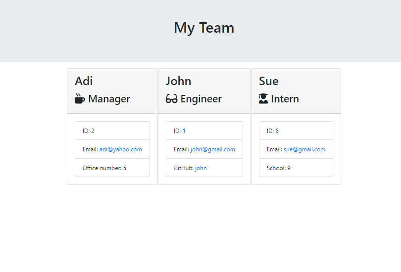

# Team-Profile-Generator

Welcome to the Weather-Dashboard repository!

## Table of content

[About](#about)
[Features](#features)
[Technologies used](#technologies-used)
[Screenshot](#screenshot)
[Link to deployed app](#link-to-deployed-app)
[License](#license)
[Getting Started](#getting-started)
[Prerequisites](#prerequisites)
[Contributing](#contributing)

## About

Team-Profile-Generator is an easy-to-use tool that helps you create web pages without the hassle of writing complicated code. Our app uses Node.js, a fast and flexible technology, along with Inquirer for simple input, and Jest for making sure everything works smoothly.

## Features

Simple and Fast:
Our app is built on Node.js, which makes it quick and responsive. It can handle many tasks, making it perfect for creating web pages effortlessly.

Easy Input with Inquirer:
Inquirer makes things easy. It asks you questions to get the information it needs, guiding you through the process of creating a web page. No need to worry about writing code – our app does it for you!

Create Web Pages Easily:
[App Name] is great at turning your answers into well-organized web page code. Whether your project is big or small, our app ensures that the code it creates is neat and easy to understand.

Reliability with Jest Testing:
We want to make sure our app works well every time. That's why we use Jest to test it thoroughly. This means you can trust [App Name] to work smoothly without any unexpected problems.

## Technologies used

Node.js, inquirer, jest

## Screenshot

## Link to deployed app

https://github.com/newbotic/Team-Profile-Generator

## License

Mit license

## Getting Started

Install the Basics:
Make sure you have Node.js installed. Just type npm install to get everything you need.

Run the App:
Start the app by typing node index.js. Answer the questions that Inquirer asks to tell the app what you want.

Get Your Web Page:
Once you've answered the questions, Team-Profile-Generator will create the code for your web page based on your answers.

Test it Out:
For those who like to check everything, run tests by typing npm run test to make sure everything is working as it should.

## Prerequisites

Web browser (e.g., Chrome, Firefox) Code editor (optional)

## Contributing

Contributions are welcome! Feel free to submit issues or pull requests.
